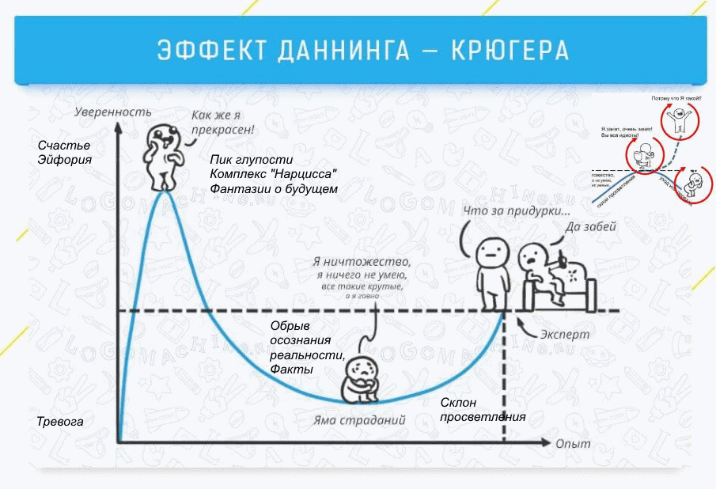

# Психология неудач при обучении ML

[TOC]

Множество попыток изучения ML заканчиваются неудачно. Например, на Курсере до конца курса Воронцова доходит 10-15%. На качественных курсах Степика этот процент может быть еще меньше - 2-5%. Много времени, денег и других ресурсов расходуется впустую. Однако даже получение сертификата не дает гарантий его использования. В чем причины неудач? Можно ли что-то сделать, чтобы их избежать, уменьшить ущерб или даже извлечь какую-то пользу?

Более того, трудности обучения скорее всего не зависят от предметной области. Неважно что учить, ловушки везде встречаются похожие. Можно ли найти общие рецепты?

Тема трудностей и ловушек в обучении касается всех. Даже если лично у вас никогда никаких трудностей не было, то они скорее всего были у ваших родственников, знакомых и т.д. Умение распознавать такие трудности и справляться с ними - ценный капитал.

Везде ниже мы предполагаем, что обучение ML заключается в самостоятельном прохождении онлайн курса на Курсере, Степике или аналоге с получением сертификата. Это дает возможность подробно описать достижение, зафиксировать цель и уровень.

## Общие причины неудач
 1. **Ложное тщеславие**. Предполагается, что профессия специалиста по ML - самая модная и денежная профессия. Кроме высоких доходов она овеяна романтикой Супер-ИИ и фантастических стартапов. Этот престиж привлекает тех, кто ранее не видел пользу математики, но требует для себя самого лучшего или просто нарцисс.
 1. **Хайп**. Реклама платных курсов заверяет, что работу в области ML легко найти после короткого обучения.
 1. **Время**. Обучение трудно совмещать с работой.  Ресурсов всегда не хватает, но действительной проблемой является их неоптимальное использование.
 1. **Выгорание мотивации**. Начальную мотивацию трудно поддерживать длительное время.

## До сертификата

### Программирование
1. Питон трудно освоить с нуля, если не было опыта программирования раньше. Это может занять от двух недель до двух лет. Это психологически и эмоционально сложная задача, требуется преодолеть высокий барьер. Это трудно или нельзя сделать без сверх-мотивации.
2. Когда базовый Питон освоен, то его трудно улучшить самостоятельно, для этого надо решить много задач или писать/читать много кода.

### Математика
 1. Мало или нет хороших прагматичных курсов по высшей математике (матрицы, производные, интегралы, основы ТВиМС). Те что есть - слишком сложные.
 2. Учиться по учебником сложно.
 3. Матан трудно освоить с нуля быстро.
 4. На длительных тяжелых курсах выгорает мотивация.
 5. Фобия к математике - частое явление.
 6. Главная проблема - не знание предмета, а интерес к решению задач, этому трудно или нельзя научить.
 7. Есть принципиальная разница между активным и пассивным матаном. Первый ориентирован на решение задач, второй - на запоминание шаблонов, любая нетипичная задача может поставить в тупик.

## После сертификата

### Недостатки курса
1. Плохой или неправильный сертификатный курс:
    * Недостаточное количество неформальных заданий в процессе обучения.
    * Недостаточное количество сложных заданий с повышенной наградой.
    * Избыточное количество сложного необязательного или малодоступного контента.
    * Неспособность пройти строгие объективные тесты в результате формального обучения или просто их отсутствие.

### Решение "задач собеседований"
1. Неспособность решать "задачи собеседований" повышенной сложности. См. Гуманитарий.

### Портфолио

Если Портфолио либо нет, либо оно плохое, то это снижает привлекательность кандидата при собеседовании: нет повода для обсуждения или первичной заочной оценки квалификации.

1. Kaggle: профиль и ноутбуки.
2. Github: проекты и код, хакатоны.
3. Личный блог, Linkedin, Facebook.

## Обсуждение

### Типы неудачников
1. **Фантазер**. Не будет ничего учить, нет успешного опыта обучения, любит помечтать о приятном, строить планы и хвастать ими.
2. **Дурак**. Не может пройти начальные шаги учебного курса: слишком тяжело, скучно, неинтересно. Дураки вполне могут быть и часто являются способными и успешными людьми, даже гораздо более успешными чем "умники" и программисты. Дурак - это просто неспособность выучить программирование или математику с нуля, но это весьма тяжелая задача для всех. "Умники" могут попробовать выучить с нуля сольфеджио или хотя бы новый язык.
3. **Лентяй**. Просто бросает курс при первых или вторых сложностях или из-за срыва дедлайна. Проблемы с мотивацией, самодисциплиной и тайм-менеджментом.
4. **Циклежник**. Может пройти несколько шагов, но быстро сдается. В итоге не может пройти сертификатный курс, начинает и бросает много раз подряд. Рассчитывает на репетиторов, платные курсы и секретные техники. Безуспешно по определению.
5. **Гуманитарий**. Гуманитарий - это не профессия вроде филолога, экономиста, финансиста, рекламиста или маркетолога. Это скорее набор склонностей противоположных инженерным, т.е. стремлению разбираться в деталях сложных объектов, что-то придумывать. Можно сказать, что гуманитария интересуют люди и результат, а инженера - техника и процесс. Гуманитарий может выучить математику, но решать сухие инженерные или математические задачи ему тяжело, точнее неинтересно. Это переводит гуманитария в группу риска для инженерных специальностей, таких как ML.  
Часто приходится слышать, что гуманитариев не существует и любой человек может на достаточном уровне освоить любой предмет. Это так, но есть разные склонности для решения разных задач. Поэтому возможна кластеризация комплексов таких склонностей.
6. **Бог**. После окончания ШАДа планирует стать Kaggle-мастером и фаундером ИИ-стартапа в Долине. Заработав несколько миллиардов, с помощью биохакинга гарантирует себе бессмертие и станет богом, бороздящим просторы вселенной. Крайне рекомендуется предусмотрительное и почтительное обращение: боги ревнивы, злопамятны, мстительны и страшны в гневе (проверено).

### Статистика неудач

Теоретически понятно, что обучение на практике - это решение задач разных типов и разного уровня сложности. Если эти результаты еще не содержатся в компьютере, то их можно как-то ввести. Это дает возможность для расчета разных метрик, построения многочисленных моделей и прогнозов. Аналогично, разные типы сложностей и ловушек также могут быть оцифрованы и подвергнуты процессу моделирования.

Это открывает множество возможностей, которые сейчас кажутся фантастическими. Например, доказательное обучение. Заказчик оплачивает обучение ребенка, заключая договор с пари-условием. Если результат ЕГЭ (или любого другого теста) будет выше заданного - исполнитель получит премию, если ниже - десятикратный штраф.

Для решения подобных задач, прежде всего, хотелось бы получить хотя бы какие-то результаты тестов или экзаменов. Сейчас это связано с какими-то космическими сложностями. Далее, надо построить модель-прогноз о том, как итоговые результаты связаны с текущими и историей прогресса.

 * Публикации на эту тему представляют большой интерес, но их мало или нет.
 * Интересен рейтинг ML-специалиста - оценка уровня на основе тестов теории и практики: уровень kaggle, github, сертификаты, портфолио.

### Психоанализ неудач
 * **Фрейд** придумал психоанализ для лечения невротических истерик. Истерика - это признак невроза, симптом, который возникает автоматически при экспозиции фрустрирующих факторов, возможно неявной. Целью психоанализа является понимание структуры невроза, механизмов его формирования, а также терапия.
 * **Карен Хорни** переосмыслила схему Фрейда, сохранив базовые механизмы, но отказавшись от особого внимания к детскому периоду. В своей последней работе "Невроз и личностный рост: Борьба за самореализацию" она сформулировала понятие "центрального внутреннего конфликта" как фрустрации из-за противоречия между "идеальным Я" и реальностью.
 * **Невроз как реакция на фрустрацию**. Упрощенное рабочее понимание: завышенная самооценка или "мания величия" сталкивается с фактами, что ведет к вытеснению или развитию других компенсаторных невротических механизмов, в т.ч. депрессий.
 * **Лечение** заключается в прояснении невротического комплекса с целью действительного и рационального решения жизненных проблем, а не бессознательной попытки такого решения с помощью невроза.
 * **Недостатки психоанализа**. Это терапевтическая, т.е. лечебная методика. Клиент рассматривается как пациент. Лечение невроза и "мании величия" может привести к отказу от амбициозной целеустремленности и негативно повлиять на итоговые результаты, помешать самореализации.
 * **Самоанализ, коуч или КПТ**. Хорни пропагандировала самоанализ как замену длительной и дорогостоящей терапии. Однако специалисты по психотерапии, психоанализу, КПТ могут принести пользу. Или мало пользы, или даже вред: доказательного психоанализа вроде бы не существует, хотя статистическое моделировании в экспериментальной психологии весьма развито.

### Польза неудач
 * Неудача в обучении всегда является ценным опытом и своего рода ресурсом. Однако без тщательного анализа и самоанализа этот опыт бесполезен или даже вреден в случае вытеснения. В последнем случае велик соблазн повторять одну и ту же ошибку много раз подряд.
 * Неудачи и поражения формируют спектр угроз, дают возможность идентифицировать врагов и отработать тактику сражений (Знай себя, знай свою территорию, знай своего врага).
 * Проигрыш в битве не означает проигрыш в войне. Чем больше цена поражения, тем выше цена урока.  
 Таких мудрых советов много в популярной литературе по саморазвитию,  самопомощи, духовным практикам и сектам.

## Как не стать неудачником
Шанс неудачи довольно велик. Нужно внимательно изучать возможные факторы неудач, чтобы попытаться исключить или смягчить их. Для этого можно:

 * Изучить наиболее частые трудности и создать свой собственный метод их преодоления.
 * Создать группу поддержки, сеть друзей.
 * Тщательно планировать обучение и карьеру. Собирать доступную информацию. Инвестировать в поиск такой полезной информации, кругозор и эксперименты. Получать обратную связь.
 * Проводить критическое обсуждение планов, результатов, успехов и неудач.
 * Использовать метод личных супер-задач.
 * Изучать типы ловушек для обучения ML с помощью ML. Собрать данные.
 * Использовать конкурентную разведку, дата-журналистику, социологические опросы.
 * Использовать полевые эксперименты.
 * Использовать коучинг и анти-коучинг.

## Коучинг и анти-коучинг

### Коуч
 1. **Психотерапия.** Коуч не фиксируется на негативном опыте, а исследует новые возможности чемпионов. Нацелен на успех и достижение, на эффективность.
 2. **Оценки.** Коуч создает атмосферу принятия и безоценочности. Я - ок, ты - ок.
 3. **Консалтинг.** Коуч не является экспертом, ментором и наставником. Он не дает советы, ограничивая возможности чемпиона, а служит ему зеркалом.
 4. **Спортивный тренер**.  Коуч не ставит цели, а раскрывает потенциал чемпиона с помощью своих инструментов и коуч-среды.

Описание коучинга интригует, вдохновляет и звучит впечатляюще. Но почему столь смелые и уверенные заявления немедленно не подтверждаются столь же убедительными статистическими данными? Коучинг вроде бы вполне рационален и нацелен на эффективность. Но либо эту эффективность нельзя измерить, либо измерить ее можно и она незначительная, либо он не вполне рационален. Это дает основание рассматривать коучинг просто как вариант психо-секты или эзотерического культа. Иначе: если коучинг рождает чемпионов, то где они?

### Анти-коуч

Коуч работает с чувствами и обращается к эмоциям, а анти-коуч работает с данными и старается обращаться к логике. Тем не менее, аргументацию коучинга не стоит сразу отбрасывать целиком: пригодится все хорошее.

1. Ошибки и негативный опыт неизбежны, но если из них не извлечь уроков, то они неизбежно будут поворяться. Как сказал бы программист: без тестов нет покрытия.
2. Без отрицательных оценок нет и  положительных. Отрицательный и положительный опыт одинаково важны. Политика полного игнорирования отрицательного опыта - странная политика, которая не доведет до добра.
3. Чемпион не может знать всего что ему надо, это абсолютно дикая нелепость. Без обучения, разведки, советов и чужого опыта не обойтись.
4. Цели не так уж трудно поставить, они, как правило, заранее известны.

### Ссылки
 * [Коучинг](https://erickson.ru/coaching/)
 * [Что такое коучинг?](https://www.1napc.ru/aboutcoaching/what-is.html)
 * [Чем является коучинг?](http://ingrp.ru/materials/chto-takoe-kouching/)
 * [Корпоративный коучинг: как мы тестировали этот метод у себя в компании](https://vc.ru/hr/101845-korporativnyy-kouching-kak-my-testirovali-etot-metod-u-sebya-v-kompanii)

### Кривая Даннинга-Крюгера
 * Иллюстрирует парадоксальное изменение самооценки в процессе обучения.
 * Может быть использована для прогнозирования.
 * Может быть использована для популярной психотерапии.
 * Недостатки: дофаминовый статус формируется прогнозами, а не опытом.

